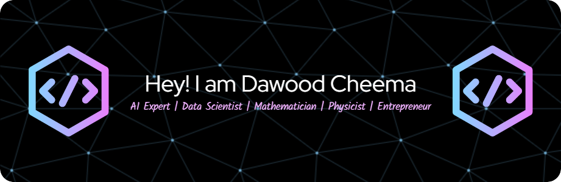

<!-- # 💫 About Me -->

#### **AI Expert | Data Scientist | Mathematician | Physicist | Entrepreneur**

Transforming ideas into innovative solutions at the intersection of AI, data analytics, and business strategy. With a strong foundation in mathematics and physics, I specialize in:

- Building **predictive models** to extract valuable insights from data.
- Developing **AI-driven solutions** for real-world challenges.
- Crafting **scalable software** for enterprise-level applications.
- Empowering businesses globally with cutting-edge technology.

### 🌐 Connect with Me

         

### 💻 Tech Stack

#### **Languages & Tools**

    

#### **Data Science & Machine Learning**

                   

#### **Cloud & Infrastructure**

    

#### **Web Frameworks**

  
  

#### **Databases**

      
 

#### 📊 GitHub Stats:

 
 

#### 🔝 Top Contributed Repo

## 📊 GitHub Stats

---

## 🔝 Top Contributed Repositories

---

#### 💰 Support My Work

 
