<!-- # 💫 About Me -->

#### **AI Expert | Data Scientist | Mathematician | Physicist | Entrepreneur**

Transforming ideas into innovative solutions at the intersection of AI, data analytics, and business strategy. With a strong foundation in mathematics and physics, I specialize in:

- Building **predictive models** to extract valuable insights from data.
- Developing **AI-driven solutions** for real-world challenges.
- Crafting **scalable software** for enterprise-level applications.
- Empowering businesses globally with cutting-edge technology.

### 🌐 Connect with Me

    

<!-- 
  
 -->

### 💻 Technical Expertise

#### **Languages & Tools**

  

#### **Data Science & Machine Learning**

    

#### **Cloud & Infrastructure**

  

#### **Web Frameworks**

#### **Databases**

   

### Projects

Explore our featured projects categorized below to see how Data Function Inc. can make a difference:

#### Data Science & AI

- **Object Detection and Recognition**

  1. [YOLOv3 Object Detection](https://github.com/dawoodcheema/object-detection-and-recognition.git)
     A python-based object detection built using the YOLOv3 deep learning model. This project processes images and videos, identifying objects and saving the results in a designated folder. It includes:

     - **Image and Video Processing**: Detect objects in static images and real-time video frames.
     - **Customizable Thresholds**: Configurable IoU and confidence thresholds for more accurate detections.
     - **Real-Time Processing**: Supports both batch image detection and real-time video processing.
        

            
            
            

        

        

        
        

        

- **Forecasting & Time Series Analysis**

  1. [LSTM Multivariate Stock Price Prediction](https://github.com/dawoodcheema/lstm-multivariate-stock-price-prediction)
     A deep learning project using LSTM for multivariate time series analysis to predict Google stock prices. Trained on five years of historical data, the model forecasts stock performance over a two-month period.
     

      
      
      

     Google stock price predictions with LSTM:  
     
     Google stock price predictions (last 50 financial days):  
     

- **Clustering & Unsupervised Learning**

  1. [Electricity Consumption Behavior Analysis](https://github.com/dawoodcheema/electricity-consumption-behavior-analysis.git)
     Analyzed electricity demand data from over 370 clients, using clustering algorithms (KMeans, Agglomerative) to uncover usage patterns. The project involved data cleaning, feature engineering, and visualizing consumption behaviors, which provided valuable insights for energy-saving strategies.
      

            
            
            

      

       
     

      <!-- 
      
      
      
      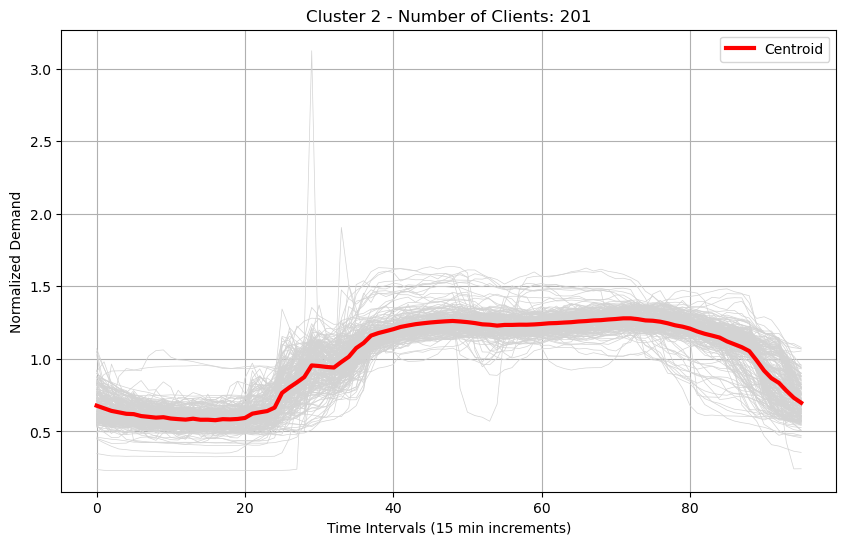
      
      
      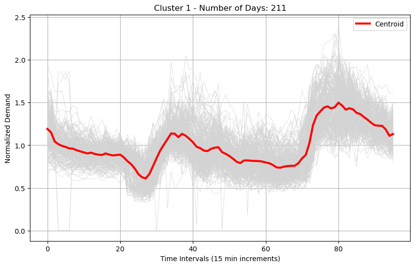
        
      
      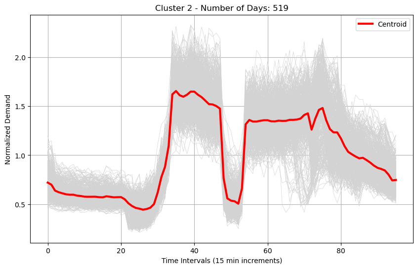
       -->

      
      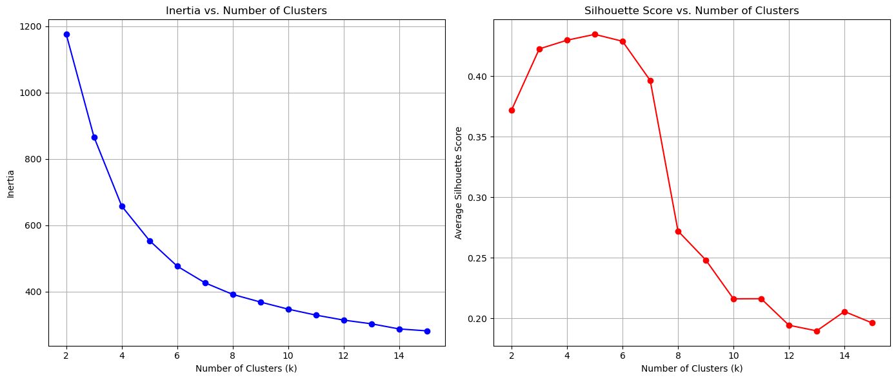

      
      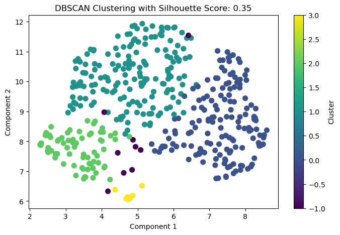

      

- **Predictive Modeling**

  1.  [Heart Disease Prediction](https://github.com/dawoodcheema/heart-disease-prediction.git)
      A machine learning model that predicts the likelihood of heart disease based on patient data. Implements logistic regression, decision trees, and neural networks for classification.

        

              
              
              

        

      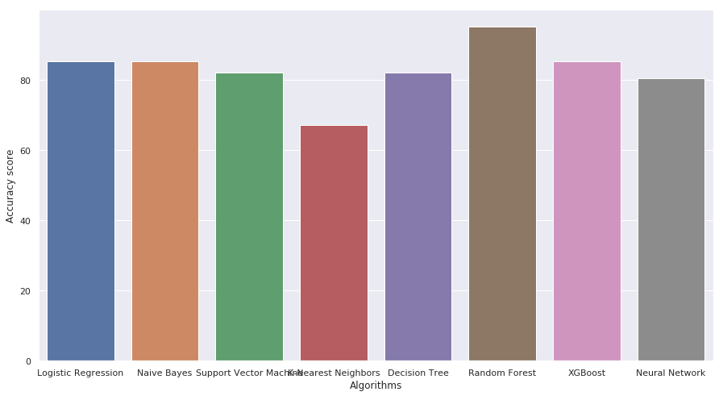

  2.  [Disease Prediction from Symptoms](https://github.com/dawoodcheema/symptoms-disease-prediction.git)
      A machine learning project that predicts diseases based on symptoms using various classification algorithms. The model takes a list of symptoms as input and predicts the most probable disease based on trained data.its feature includes. - Implementation of multiple ML algorithms: Naive Bayes, Decision Tree, Random Forest, Gradient Boosting - Supports two datasets:
          - Kaggle Dataset (133 symptoms + prognosis)
          - Columbia Dataset (Disease occurrences & symptoms)
      

      
      
      

      

       

<!-- - **Natural Lanuage Processing**

  - A cutting-edge object detection model built using YOLOv5.
  - [Project Link](#)
  - 

- **Forecasting (time series analysis)**

  - A cutting-edge object detection model built using YOLOv5.
  - [Project Link](#)
  - 

- **Prediction modelling**

  - A cutting-edge object detection model built using YOLOv5.
  - [Project Link](#)
  -  -->

- **Reinforcement learning**

  1. [Chess Engine: AI Mastery with Reinforcement Learning](https://github.com/dawoodcheema/chess-engine)

     Build an AI chess engine that learns strategies through **self-play** and **reinforcement learning**.

     - Learns chess from scratch using **Q-learning**.
     - Adapts strategies with a neural network for smarter gameplay.
     - Visualizes decision-making in real time.
     - Tools and Technology: Python, PyTorch, python-chess,Deep Q-Learning and visualization libraries.
       

       
       
       

     

     
     
     
     
     
     
     
     
       
     
     
     
     
     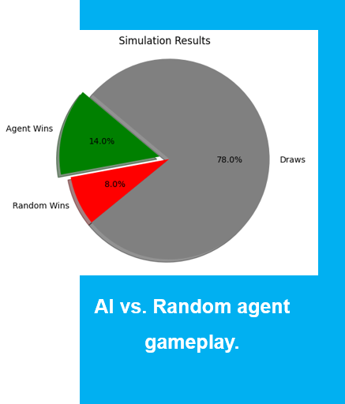
       
     

     - Visuals of the agent playing the game:
     

      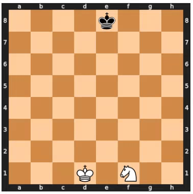
     

#### Data Analytics & Business Intelligence

Have extensive experience in the following tools and services:

1. [Power BI](#power-bi-projects): We build interactive dashboards and reports that help businesses visualize and track their performance metrics in real-time.
2. [Tableau Projects](#tableau-projects): Our Tableau dashboards provide powerful insights with dynamic filters, visuals, and easy-to-digest reports.
3. [Excel Projects](#excel-projects): From financial modeling to data cleaning and forecasting, we use Excel's advanced features for in-depth data analysis.

- #### Power BI Projects

  1. [Sales Dashboard](https://github.com/dawoodcheema/sale-dashboard)
     An interactive, real-time sales dashboard providing in-depth analysis, customer basket insights, and performance tracking.

     **Features:**

     - Real-time sales analytics
     - Customer & store basket analysis
     - Interactive filter pane for seamless exploration
     - Detailed product and store performance insights

     
     <!-- [Explore the project](https://github.com/lunaSnowflake/Sales-Dashboard) -->

- #### Tableau Projects

  1.  [UT Mart Sales Analytics Dashboard](https://github.com/DataFunctionInc/sales-analytics-utmart.git)
      The **UT Mart Sales Analytics Dashboard** provides an interactive view of sales, profit, and quantity sold across different product categories and regions. This dashboard is designed for business intelligence, helping stakeholders quickly assess business performance.
      **Features:**

      - Sales, profit, and quantity overview by time period.
      - Category-wise and region-wise performance analysis.
      - Profit calculation based on a 30% margin assumption.
      - Interactive filters for deep data exploration.

      

  2.  [Amazon Shipping Analytics Dashboard](https://github.com/DataFunctionInc/amazon-shipping-analytics.git)
      The **Amazon Shipping Analytics Dashboard** enables logistics managers to track orders, shipping status, and shipment locations. It provides insights into monthly shipping statistics to help make data-driven decisions regarding logistics.

      **Features:**

      - Displays total orders processed and shipped.
      - Tracks outstanding orders by day and location.
      - Interactive filters for viewing shipping data by different time periods.

      

  3.  [Tesla Stock Price Analytics Dashboard](https://github.com/DataFunctionInc/tesla-stock-price-analysis.git)
      The **Tesla Stock Price Analytics Dashboard** visualizes Tesla’s stock price trends, focusing on the last 3 months. This dashboard helps shareholders track stock performance and identify any emerging trends.

      **Features:**

      - Shows stock price fluctuations over time.
      - Daily data updates for real-time stock monitoring.
      - Interactive filters for selecting different time.

      

<!-- - ##### Excel Projects
  - **Sales Forecasting Model**
    - I will add description here -->

#### Databases & Big Data

Have design and managed production scale databased extensive experience in web application frontends using the following set of technologies:

1. [ERP System](#):
   Designed and implemented a comprehensive 𝗦𝗤𝗟 𝗱𝗮𝘁𝗮𝗯𝗮𝘀𝗲 𝘀𝗰𝗵𝗲𝗺𝗮 for a multi-functional enterprise system and financial transactions. 𝗧𝗵𝗲 𝗽𝗿𝗼𝗷𝗲𝗰𝘁 𝗶𝗻𝘃𝗼𝗹𝘃𝗲𝗱 𝗱𝗲𝘃𝗲𝗹𝗼𝗽𝗶𝗻𝗴 𝗮𝗻𝗱 𝗻𝗼𝗿𝗺𝗮𝗹𝗶𝘇𝗶𝗻𝗴 𝗰𝗼𝗺𝗽𝗹𝗲𝘅 𝗿𝗲𝗹𝗮𝘁𝗶𝗼𝗻𝗮𝗹 𝘁𝗮𝗯𝗹𝗲𝘀, 𝗲𝘀𝘁𝗮𝗯𝗹𝗶𝘀𝗵𝗶𝗻𝗴 𝗿𝗲𝗹𝗮𝘁𝗶𝗼𝗻𝘀𝗵𝗶𝗽𝘀, 𝗮𝗻𝗱 𝗼𝗽𝘁𝗶𝗺𝗶𝘇𝗶𝗻𝗴 𝗱𝗮𝘁𝗮 𝘀𝘁𝗼𝗿𝗮𝗴𝗲. Integrated robust indexing strategies for efficient query performance across modules, while ensuring data integrity and scalability for future expansions.
   

      
      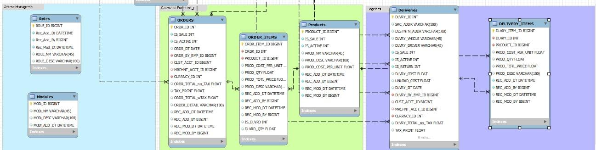
    
         
      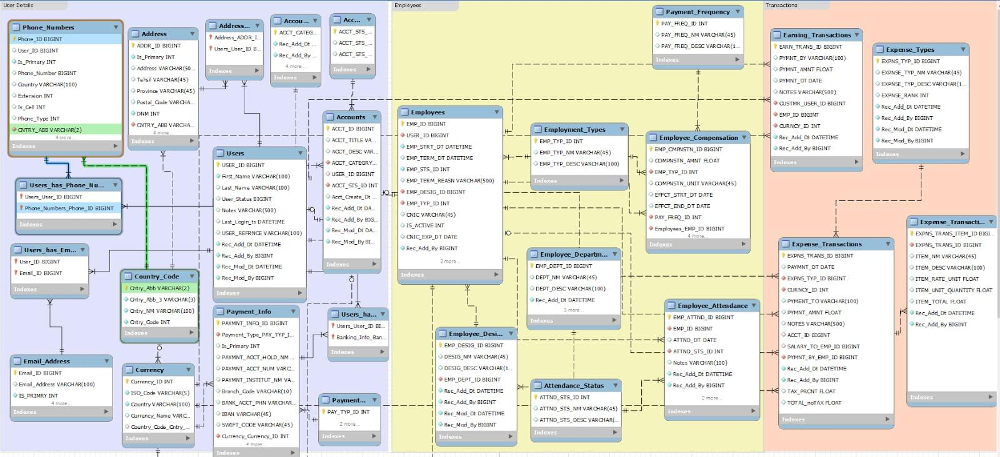
   

#### Frontend Development

Our team has extensive experience in web application frontends using the following set of technologies:

1. [React JS](#react-js-projects): We create robust web applications with dynamic UIs, including dashboards, applications, and tools for real-time data visualization and management.

- #### React JS Projects

  1. [SceneFlex](https://github.com/DataFunctionInc/sceneflex.git)
     A movie application that allows users to browse, search, and view movie details with a user-friendly interface.
     - **Features**:
       Dynamic Movie Browsing: Explore movies by genre, popularity, and search for specific titles.
       Detailed Movie Information: Access movie details such as cast, release date, runtime, trailers, and more.
       Responsive UI: Fully responsive design optimized for various devices.
       API Integration: Fetches real-time movie data using TMDb's powerful API.
     - **Preview**:
     

     
     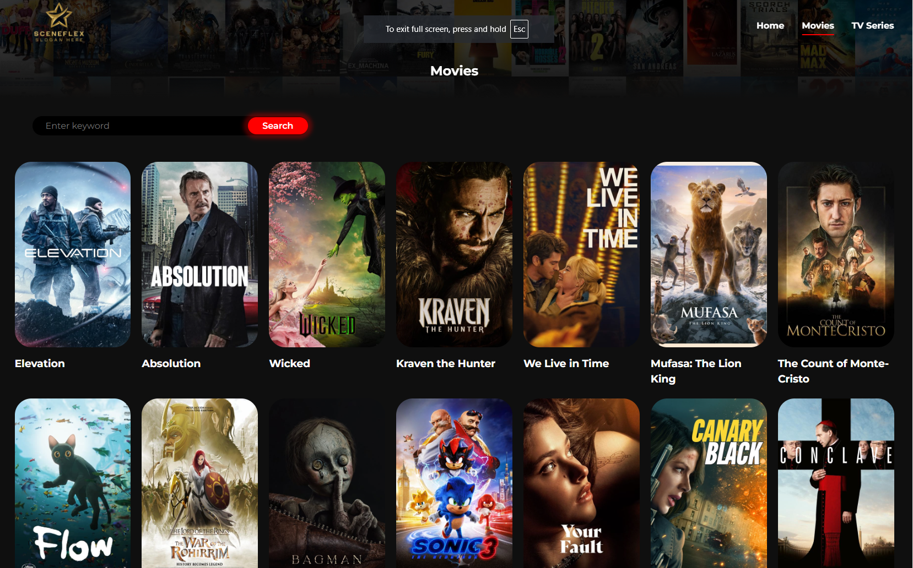
     
     
       
     
      

      <!--   
       -->

### 📊 GitHub Stats:

<!--
 
  -->

<!-- 
 -->

#### 🔝 Top Contributed Repo

#### 💰 Support My Work

 
